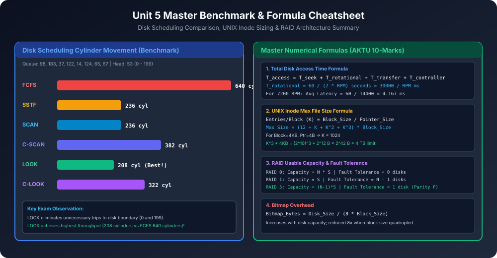

# Module 14: Unit 5 AKTU PYQs and Interview Cheatsheet

Yeh module AKTU Semester Exam (BCS401) ke past 5 years ke high-weightage 10-mark numericals aur FAANG / Operating System Engineer interview questions ka complete solved repository hai.

---

## 1. Master Benchmark & Formula Summary

---

## 2. AKTU Solved 10-Marker PYQs

### PYQ 1: Complete Disk Scheduling Comparison
> **Question (AKTU 2021, 2023 - 10 Marks):**
> Ek disk queue me requests hain: `98, 183, 37, 122, 14, 124, 65, 67`.
> Initial head position = `53`. Disk cylinder range = `0 to 199`. Head higher cylinders ki taraf move kar raha hai.
> Calculate total head movement (seek count) for:
> 1. FCFS
> 2. SSTF
> 3. SCAN
> 4. C-SCAN
> 5. LOOK
> 6. C-LOOK

#### Step-by-Step Complete Solution:

#### 1. FCFS (First-Come, First-Served):
- **Path:** $53 \rightarrow 98 \rightarrow 183 \rightarrow 37 \rightarrow 122 \rightarrow 14 \rightarrow 124 \rightarrow 65 \rightarrow 67$
- **Calculations:**
  - $|98 - 53| = 45$
  - $|183 - 98| = 85$
  - $|37 - 183| = 146$
  - $|122 - 37| = 85$
  - $|14 - 122| = 108$
  - $|124 - 14| = 110$
  - $|65 - 124| = 59$
  - $|67 - 65| = 2$
- **Total Head Movement:** $45 + 85 + 146 + 85 + 108 + 110 + 59 + 2 = \mathbf{640\text{ Cylinders}}$.

#### 2. SSTF (Shortest Seek Time First):
- Starting at 53: Sorted remaining = `14, 37, 65, 67, 98, 122, 124, 183`
- From 53: Closest is 65 ($|65-53|=12$)
- From 65: Closest is 67 ($|67-65|=2$)
- From 67: Closest is 37 ($|37-67|=30$)
- From 37: Closest is 14 ($|14-37|=23$)
- From 14: Closest is 98 ($|98-14|=84$)
- From 98: Closest is 122 ($|122-98|=24$)
- From 122: Closest is 124 ($|124-122|=2$)
- From 124: Closest is 183 ($|183-124|=59$)
- **Total Seek:** $(67 - 53) + (67 - 14) + (183 - 14) = 14 + 53 + 169 = \mathbf{236\text{ Cylinders}}$.

#### 3. SCAN (Elevator to boundary 199):
- Head moves towards 199 servicing: $53 \rightarrow 65 \rightarrow 67 \rightarrow 98 \rightarrow 122 \rightarrow 124 \rightarrow 183 \rightarrow 199$
- Reverses at 199 and services downwards: $199 \rightarrow 37 \rightarrow 14$
- **Formula:** $(199 - 53) + (199 - 14) = 146 + 185 = \mathbf{236\text{ Cylinders}}$.

#### 4. C-SCAN (Circular SCAN to boundaries 199 and 0):
- Upward: $53 \rightarrow 65 \rightarrow 67 \rightarrow 98 \rightarrow 122 \rightarrow 124 \rightarrow 183 \rightarrow 199$ (Distance = $199 - 53 = 146$)
- Return to 0: $199 \rightarrow 0$ (Distance = $199$)
- Upward from 0: $0 \rightarrow 14 \rightarrow 37$ (Distance = $37 - 0 = 37$)
- **Total Seek:** $146 + 199 + 37 = \mathbf{382\text{ Cylinders}}$.

#### 5. LOOK (Stops at max request 183):
- Upward: $53 \rightarrow 65 \rightarrow 67 \rightarrow 98 \rightarrow 122 \rightarrow 124 \rightarrow 183$ (Distance = $183 - 53 = 130$)
- Reverses at 183 to min request 14: $183 \rightarrow 37 \rightarrow 14$ (Distance = $183 - 14 = 169$)
- Wait, total distance: $(183 - 53) + (183 - 14) = 130 + 169 = \mathbf{208\text{ Cylinders}}$. *(Most optimal!)*

#### 6. C-LOOK (Circular LOOK between requests):
- Upward: $53 \rightarrow 65 \rightarrow 67 \rightarrow 98 \rightarrow 122 \rightarrow 124 \rightarrow 183$ (Distance = $183 - 53 = 130$)
- Return to min request 14: $183 \rightarrow 14$ (Distance = $183 - 14 = 169$)
- Upward from 14 to 37: $14 \rightarrow 37$ (Distance = $37 - 14 = 23$)
- **Total Seek:** $130 + 169 + 23 = \mathbf{322\text{ Cylinders}}$.

---

### PYQ 2: UNIX Inode Maximum File Size Derivation
> **Question (AKTU 2022 - 10 Marks):**
> Ek UNIX file system me block size = 4 KB ($4096\text{ Bytes}$) aur disk address pointer = 4 Bytes hai.
> Inode contains:
> - 12 Direct pointers
> - 1 Single indirect pointer
> - 1 Double indirect pointer
> - 1 Triple indirect pointer
> 
> Calculate:
> 1. Number of disk addresses in one index block.
> 2. Maximum file size supported by this file system.

#### Solution:
1. **Pointers per Block ($K$):**
   $$K = \frac{\text{Block Size}}{\text{Pointer Size}} = \frac{4\text{ KB}}{4\text{ B}} = \frac{4096}{4} = \mathbf{1024} = 2^{10}\text{ pointers}$$

2. **Capacity Breakdown:**
   - **Direct Blocks:**
     $$12 \times 4\text{ KB} = 48\text{ KB}$$
   - **Single Indirect:**
     $$1 \times K \times 4\text{ KB} = 1024 \times 4\text{ KB} = 4\text{ MB}$$
   - **Double Indirect:**
     $$1 \times K^2 \times 4\text{ KB} = (1024)^2 \times 4\text{ KB} = 1024 \times 4\text{ MB} = 4\text{ GB}$$
   - **Triple Indirect:**
     $$1 \times K^3 \times 4\text{ KB} = (1024)^3 \times 4\text{ KB} = 1024 \times 4\text{ GB} = \mathbf{4\text{ TB}}$$

3. **Total Maximum File Size:**
   $$\text{Max Size} = 48\text{ KB} + 4\text{ MB} + 4\text{ GB} + 4\text{ TB} \approx \mathbf{4.004\text{ TB}} \approx \mathbf{4\text{ TB}}$$

---

### PYQ 3: RAID 0, 1, 5, 6 Comparison
> **Question (AKTU 2020, 2022 - 10 Marks):**
> Explain RAID architecture. Compare RAID 0, 1, 5 and 6 on storage efficiency, fault tolerance and write penalty.

| Feature | RAID 0 (Striping) | RAID 1 (Mirroring) | RAID 5 (Distributed Parity) | RAID 6 (Dual Parity) |
| :--- | :--- | :--- | :--- | :--- |
| **Minimum Disks** | 2 | 2 | 3 | 4 |
| **Usable Capacity** | $N \times S$ (100%) | $1 \times S$ (50% if $N=2$) | $(N - 1) \times S$ | $(N - 2) \times S$ |
| **Storage Efficiency** | 100% | $\frac{1}{N} \times 100\%$ | $\frac{N-1}{N} \times 100\%$ | $\frac{N-2}{N} \times 100\%$ |
| **Fault Tolerance** | 0 disks (Data lost) | Up to $N-1$ disks | Exactly **1 disk** | Exactly **2 disks** |
| **Write Penalty** | 0 (Parallel write) | $2\times$ Writes | **4 I/Os** (2 reads, 2 writes) | **6 I/Os** (3 reads, 3 writes) |
| **Read Speed** | Highest | Very Fast | High | High |
| **Use Case** | Video editing, Gaming | OS Boot Drives | Enterprise Web Servers | Large archival storage |

---

## 3. High-Yield Interview Q&A (FAANG / Core Systems)

### Q1: Why do Solid State Drives (SSDs) not use SCAN or Elevator Disk Scheduling?
**Answer:**
SSDs me koi physical platter ya moving mechanical arm/head nahi hota. 
- Inme data flash memory chips me electrical charges ke form me store hota hai.
- Any block can be accessed in constant time $O(1)$ regardless of cylinder address.
- Seek time aur rotational latency SSDs me **0** hoti hai.
- Isliye SCAN/LOOK scheduling SSDs me useless hai. Balki SSDs **NVMe parallel queues** aur **No-Op / FIFO / Blk-mq (Block Multi-Queue)** schedulers use karti hain taaki CPU overhead minimal rahe.

### Q2: What is the difference between Hard Links and Soft (Symbolic) Links at the Inode Level?
**Answer:**
1. **Hard Link:**
   - Ek nayi directory entry banti hai jo **existing file ke same Inode Number** ko point karti hai.
   - File ka inode reference count (`i_nlink`) 1 badh jaata hai.
   - Original file delete karne par bhi data delete nahi hota jab tak reference count > 0 hai.
   - Cannot span across different file systems/partitions (kyunki inode numbers per-filesystem unique hote hain).
2. **Soft Link (Symlink):**
   - Ek brand new file banti hai jiska apna **unique Inode Number** hota hai.
   - Iska data block target file ka **text path string** store karta hai (e.g., `/home/user/doc.txt`).
   - Original file delete ho jaye toh link break ho jaata hai (Dangling Pointer).
   - Can easily span across different filesystems and network drives.

### Q3: Why does Linux separate Inode from Dentry (Directory Entry)?
**Answer:**
Linux VFS dentry ko memory me cache karta hai (**Dentry Cache / dcache**). 
- Inode disk metadata hai jo block pointers aur permissions store karta hai, lekin file name store nahi karta.
- Dentry file name aur Inode number ke beech mapping banata hai.
- Separating them allows fast hierarchical path lookup (e.g. `/usr/local/bin/python`) directly from RAM dcache without doing expensive disk reads to inspect inodes.
